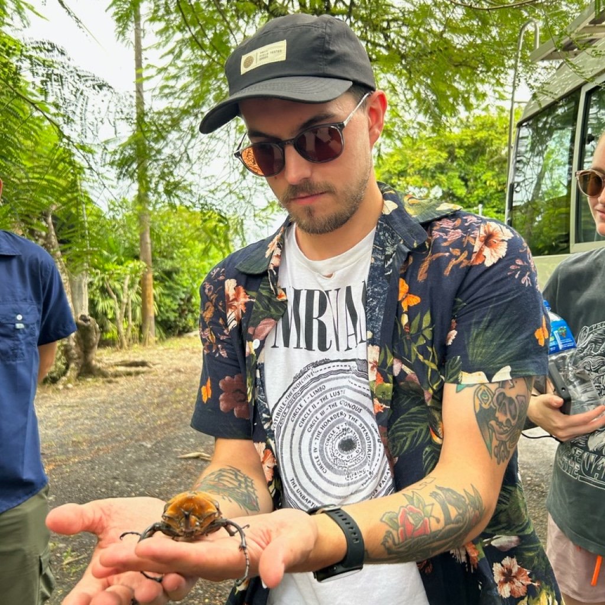

## **Who are you and what do you do?**

My name is Rob. I’m a product designer who codes based in the UK. I guess I’d call myself a design engineer as that’s the modern nomenclature of the day but whatever. I went freelance last August after leading design at Lantum, a health startup where we built scheduling software for the NHS.

## **What first got you into tech?**

We got our first computer in ‘98. My dad got put on a training program at work where he got to be the first guy using a computer. He went out and bought one for the house soon after. I used to sit there and watch him try and use this magical machine.

But it was really MySpace that got me into the web. I learnt HTML/CSS from books and blogs I found. I would customise my own theme with random stuff. Eventually my friends asked me to do theirs, and so did the girls in my class.  I also made forum signatures when people used to go on forums back in the day. That’s where my interest in design and tech met.

## What does your typical working day look like?

Since going freelance my day depends on who I’m currently working with.

But usually I wake up around 8 and take my dog on a walk. It wakes me up and calms him down. I tend to work from my spare room but sometimes I’ll go into a local co-working space. In the summer I’ll try my best to go in on my motorbike.

I start by reviewing what I had planned for that week. I try to set 2 or 3 big goals for the week so I can keep my focus and not get too distracted. Then I try to get anything boring out the way early like replying to emails, finance stuff, or status meetings.

The rest day is usually spent either working with code, sketching, or talking to customers. I try to spend as much time as I can on these core activities.

Usually I break for lunch and walk Milo again mid afternoon. If my wife is home we grab a coffee at our local coffee spot on the way.

When I get back I’ll jump back into some code, sketching ideas, or reviewing customer feedback calls.

I stop at around 6/7 to work out and make dinner in the evening. After that I either go to the pub or sometimes jam on side projects if Harriet is working a night shift.

## What’s your setup? Software and hardware. Pictures welcomed!

I bought a Mac Mini M4 last year and it rocks. I can travel with it super easy and it still has everything I need for dev work. I’m a typical designer so I use a lot of Apple stuff.

### Hardware looks like:

- BenQ Designer 4k Monitor
- Apple Magic Keyboard
- Logitech M3 Mouse
- iLoud Monitors
- Apple Airpod Max cans

### Software looks like:

- Cursor for coding
- Figma for design
- Raycast for productivity
- Perplexity for search
- Linear/Things - depending if I’m doing team work or solo work

Even though I use Cursor I don’t use AI that much. For me it’s a great pair programmer I can use to review my code before I push it to a PR. I hardly use the composer stuff, although I know a lot of people who swear by it.

## What’s the last piece of work you feel proud of?

I’ve been working with articial, a AI-led insurance company. I built them a complete set of React components from scratch. We found that having pieces prebuilt we could start to prototype design ideas in code super easily. Some of the guys who don’t code even used Cursor with these components to turn their ideas into something more realistic.

It was great to see how something so simple unlocked such creativity in the team.

Also I’ve recently redesigned my website. There’s a ton of little personal touches which I really like. I’m trying out Tidal over Spotify because it has higher-quality music streaming. I built a custom API to connect to last.fm, which connects to Tidal, so whenever I’m playing music - it shows up on my website.

## What’s one thing about your profession you wish more people knew?

I wish more designers worked in code. I love that AI tools like Cursor or v0 have made it so easy to throw together prototypes in real code. However, I think these still abstract designers away from what the product truly is. Working directly with the code allows you to suspend disblief and start expericing the product like your users do. The more you break down these barriers the better the experience becomes.

## Share with others something worth checking out. Not necessarily tech related. Shameless plugs welcomed.

I recently pulled together some learnings around using Motion for the web. If you’re interested - check it out: [https://motion.heymynameisrob.com](https://motion.heymynameisrob.com)
